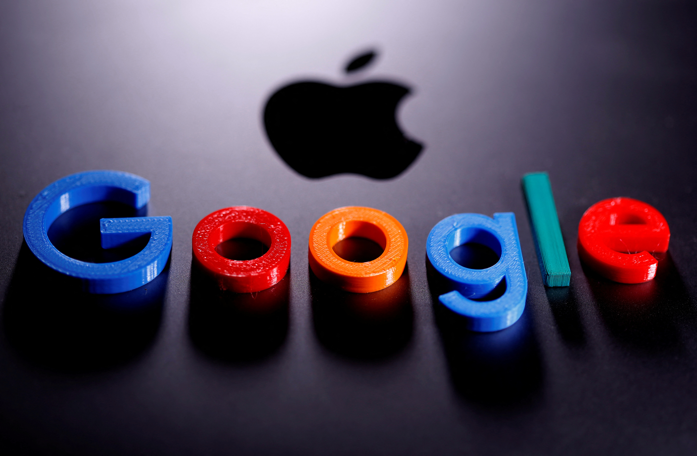

# Twitter Sentiment Analysis for Apple and Google Products

# Project Overview

NiaTech has initiated a project aimed at enhancing customer engagement and optimizing marketing strategies by conducting sentiment analysis of tweets related to Apple and Google products. Over the past year, NiaTech has actively promoted and sold products from these tech giants. With a substantial portion of customer interactions occurring on Twitter, understanding public sentiment is crucial for refining business strategies and improving customer experience.

This project seeks to develop a machine learning model that classifies sentiments expressed in tweets as positive, negative, or neutral. By accurately categorizing these sentiments, NiaTech will gain valuable insights into customer perceptions, identify potential product issues, and uncover opportunities for enhancement.

# Objectives

>- *Develop a Sentiment Classification Model:* Build a machine learning model capable of accurately classifying tweet sentiments (positive, negative, or neutral) for Apple and Google products.
>- *Sentiment Analysis by Product:* Analyze and identify which products from Apple and Google receive the highest and lowest sentiment scores, highlighting potential areas for improvement.
>- *Sentiment Trends:* Assess overall sentiment trends towards Apple and Google products to inform strategic decisions about NiaTech’s ongoing partnerships with these companies.

# Data Understanding

The dataset used in this analysis was sourced from data.world and consists of 9093 rows and 3 columns:

**Tweet:** The text of the tweet.
**Sentiment:** The sentiment expressed in the tweet (positive, negative, or neutral).
**Product:** The product (Apple or Google) mentioned in the tweet.

# Data Preparation

Data cleaning was a crucial step in ensuring high-quality inputs for model development. Key processes included:

1. Renaming columns for clarity.
2. Handling missing values to maintain data integrity.
3. Removing duplicate entries to eliminate redundancy.
4. Text normalization, which involved converting text to lowercase, removing URLs, special characters, and stopwords.

The Pandas and NLTK libraries were utilized for text preprocessing, which included tokenization, stemming/lemmatization, and stopword removal. These steps ensured a cleaner and more focused dataset for accurate sentiment analysis.

# Exploratory Data Analysis (EDA)

During the EDA phase, several key insights were uncovered, such as the imbalance in sentiment distribution. Visualizations, including sentiment count distributions and word clouds, provided an in-depth understanding of the data, helping to guide model development and fine-tuning.

Key Insights:
Sentiment distribution for both Apple and Google products was skewed, with neutral sentiments dominating.

# Modeling

In this section, various machine learning algorithms were explored to predict sentiment, including:

* Logistic Regression
* Support Vector Machine (SVM)
* Random Forest
* Naive Bayes

Each model was evaluated based on its ability to classify tweet sentiments accurately. Grid Search Cross-Validation was used to fine-tune model hyperparameters, resulting in improved performance.

# Top Performing Model:
The NLP model, fine-tuned using Grid Search CV, achieved an accuracy of 89% across all sentiment classes (positive, negative, and neutral). This model was selected as the final model due to its robustness and reliability in handling diverse sentiments.

# Model Evaluation

The model's performance for negative sentiments, neutral sentiments, and positive sentiments was improved after hyperparameter tuning, leading to better overall classification results. The tuning process further enhanced the model's performance, making it more reliable for sentiment analysis tasks. The model's robustness and ability to handle diverse sentiments make it a valuable tool

# Summary Findings

1. **Apple Dominated Discussions:** A larger share of tweets were directed toward Apple products, reflecting the brand's higher visibility compared to Google.

2. **Neutral Sentiments Were Prevalent:** Neutral sentiments constituted the majority, outpacing both positive and negative sentiments, indicating that most customers expressed balanced or indifferent opinions about these products.

# Conclusion

Google and Apple products enjoy widespread usage worldwide. This study successfully achieved its objectives by analyzing the sentiment dynamics surrounding these products on Twitter. The NLP model, optimized using Grid Search CV, performed impressively, attaining an accuracy of 89% across all sentiment categories. Hyperparameter tuning significantly improved the model's performance for negative, neutral, and positive sentiments, resulting in enhanced overall classification results. This tuning process not only bolstered the model’s reliability for sentiment analysis tasks but also showcased its robustness and capacity to handle diverse sentiments, making it a valuable tool for deriving insights from customer feedback.

# Future Work

* **Extend Time Frame for Analysis:** Analyze sentiment over a longer period to identify trends and impacts of product launches and events.
* **Segment Analysis by Demographics:** Analyze sentiment based on age, gender, and location to tailor marketing strategies effectively. 
* **Develop Predictive Models:** Create models to anticipate shifts in sentiment, allowing clients to adjust strategies proactively.
* **Integrate Insights with Clients:** Collaborate with clients to weave sentiment insights into marketing strategies, content creation, and social media campaigns.

# For More Information
See the full analysis in the [Juptyer Notebook](robert.ipynb) or review the[Presentation](Presentation.pdf)